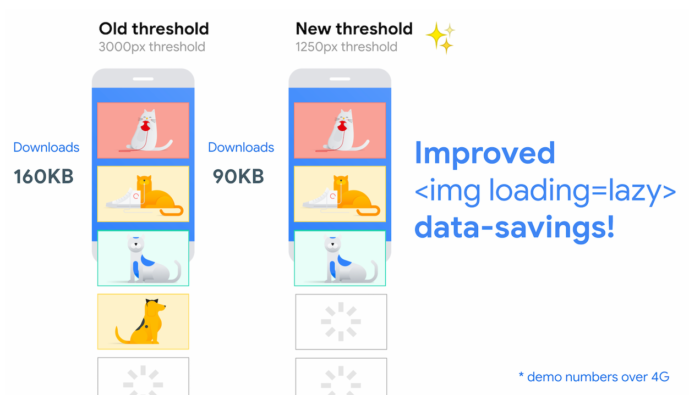
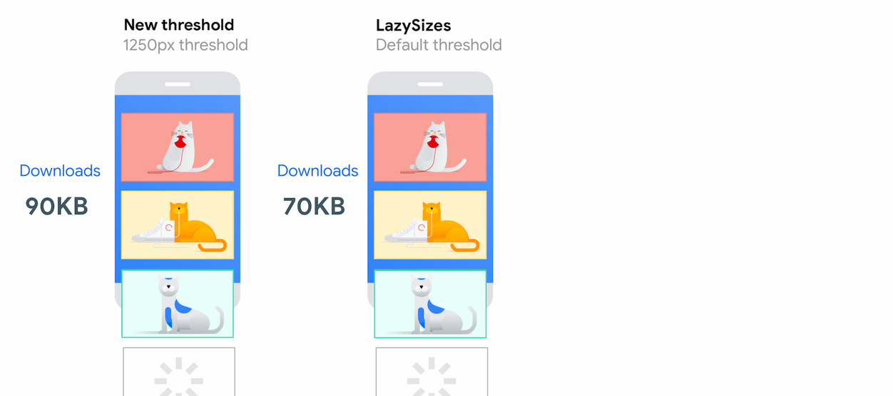

# 浏览器内置图像延迟加载

现在浏览器已经支持延迟加载图像！该视频展示了该功能的演示：

<video autoplay loop muted playsinline width="800">
  <source src="./img/lazyload.webm" type="video/webm">
</video>

从 Chrome 76 开始，您可以使用该 `loading` 属性来延迟加载图像，而无需编写自定义延迟加载代码或使用单独的 JavaScript 库。让我们深入了解细节。

## 浏览器兼容性

`` 受大多数流行的 Chromium 驱动的浏览器（Chrome、Edge、Opera）和 Firefox 支持。WebKit (Safari) 的实施正在进行中。caniuse.com提供有关跨浏览器支持的详细信息。不支持该 `loading` 属性的浏览器会直接忽略它而不会产生副作用。

## 为什么是浏览器级别的延迟加载？

根据 HTTPArchive，图像是大多数网站最需要的资产类型，并且通常比任何其他资源占用更多的带宽。在第 90 个百分位，网站在桌面和移动设备上发送大约 4.7 MB 的图像。那是很多猫的照片。

目前，有两种方法可以延迟加载离屏图像：

- 使用 Intersection Observer API
- 使用 `scroll`、`resize` 或 `orientationchange` 事件处理程序

任何一个选项都可以让开发人员包含延迟加载功能，并且许多开发人员已经构建了第三方库来提供更易于使用的抽象。但是，由于浏览器直接支持延迟加载，因此不需要外部库。浏览器级别的延迟加载还确保即使客户端禁用了 JavaScript，图像的延迟加载仍然有效。

## loading 属性

今天，Chrome 已经根据设备视口的位置以不同的优先级加载图像。视口下方的图像以较低的优先级加载，但仍会尽快获取它们。

在 Chrome 76+ 中，您可以使用该loading属性来完全延迟加载可以通过滚动到达的屏幕外图像：

```html

```

以下是该 loading 属性支持的值：

- `auto`: 浏览器默认的延迟加载行为，与不包含属性相同。
- `lazy`：推迟资源的加载，直到它到达与视口的计算距离。
- `eager`：立即加载资源，无论它位于页面上的哪个位置。

**警告**

虽然在 Chromium 中可用，但该 `auto` 值未在规范中提及。由于它可能会发生变化，因此我们建议在包含它之前不要使用它。

## 距离视口阈值

所有首屏图像（即无需滚动即可立即查看）正常加载。那些远低于设备视口的内容仅在用户滚动靠近它们时才会被获取。

Chromium 的延迟加载实现试图确保屏幕外图像足够早地加载，以便在用户滚动靠近它们时完成加载。通过在它们在视口中可见之前获取附近的图像，我们可以最大限度地提高它们在可见时已经加载的机会。

与 JavaScript 延迟加载库相比，获取滚动到视图中的图像的阈值可能被认为是保守的。Chromium 正在寻求更好地使这些阈值与开发人员的期望保持一致。

在 Android 上使用 Chrome 进行的实验表明，在 4G 上，97.5% 的延迟加载的首屏图像在可见后 10 毫秒内完全加载。即使在慢速 2G 网络上，92.6% 的首屏图像在 10 毫秒内完全加载。这意味着浏览器级别的延迟加载提供了关于滚动到视图中的元素可见性的稳定体验。

距离阈值不是固定的，取决于几个因素：

- 正在获取的图像资源的类型
- 是否在 Android 版 Chrome 上启用精简模式
- 有效连接类型

您可以在 Chromium 源中找到不同有效连接类型的默认值。随着 Chrome 团队改进启发式方法以确定何时开始加载，这些数字，甚至仅在与视口达到一定距离时才获取的方法可能会在不久的将来发生变化。

在 Chrome 77+ 中，您可以通过在 DevTools 中限制网络来试验这些不同的阈值。同时，您需要使用该 `about://flags/#force-effective-connection-type` 标志覆盖浏览器的有效连接类型。

## 改进的数据节省和视口距离阈值

截至 2020 年 7 月，Chrome 已做出重大改进，以对齐图像延迟加载距离视口阈值，以更好地满足开发人员的期望。

在快速连接（例如 4G）上，我们将 Chrome 的视口距离阈值从降低 `3000px` 到 `1250px`，在较慢的连接（例如 3G）上，将阈值从 `4000px` 更改为 `2500px`。这种变化实现了两件事：

- `` 行为更接近 JavaScript 延迟加载库提供的体验。
- 新的视口距离阈值仍然允许我们保证图像在用户滚动到它们时可能已经加载。

您可以在下面的快速连接 (4G) 上找到我们的一个演示的新旧距离阈值之间的比较：

旧阈值。与新阈值：



以及新的阈值与 LazySizes（一个流行的 JS 延迟加载库）：



为确保使用最新版本的 Chrome 用户也能从新阈值中受益，我们向后移植了这些更改，以便 Chrome 79 - 85（包括）也使用它们。如果尝试比较旧版 Chrome 与新版 Chrome 的数据节省，请记住这一点。

我们致力于与 Web 标准社区合作，以探索在不同浏览器之间如何接近视口距离阈值的更好一致性。

## 图片应包含尺寸属性

当浏览器加载图像时，它不会立即知道图像的尺寸，除非这些是明确指定的。为了使浏览器能够在页面上为图像保留足够的空间，建议所有 `` 标签都包含 `width` 和 `height` 属性。如果没有指定尺寸，可能会发生布局变化，这在需要一些时间才能加载的页面上更为明显。

```html

```

或者，直接以内联样式指定它们的值：

```html

```

设置维度的最佳实践适用于 `` 标签，无论它们是否被延迟加载。使用延迟加载，这可以变得更加相关。在现代浏览器中设置 `width` 和 `height` 打开图像还允许浏览器推断其固有大小。

在大多数情况下，如果不包括尺寸，图像仍然是延迟加载的，但是您应该注意一些边缘情况。如果没有指定width，height图像尺寸最初为 0×0 像素。如果您有此类图像的画廊，浏览器可能会得出结论，它们一开始都适合视口，因为每个几乎不占用空间，并且没有图像被推到屏幕外。在这种情况下，浏览器确定所有这些都对用户可见，并决定加载所有内容。

此外，指定图像尺寸会降低发生布局变化的机会。如果您无法为图像添加尺寸，则延迟加载它们可能是在节省网络资源和可能面临更大的布局转移风险之间进行权衡。

虽然 Chromium 中的延迟加载是以这样一种方式实现的，即图像一旦可见就可能会被加载，但它们可能还没有被加载的可能性仍然很小。在这种情况下，此类图像上的缺失width和height属性会增加它们对 Cumulative Layout Shift 的影响。

查看此演示，了解该 `loading` 属性如何处理 100 张图片。

使用该 `<picture>` 元素定义的图像也可以延迟加载：

```html
<picture>
  <source media="(min-width: 800px)" srcset="large.jpg 1x, larger.jpg 2x">
  
</picture>
```

尽管浏览器会决定从任何 `<source>` 元素中加载哪个图像，但该loading属性只需要包含在后备 `` 元素中。

## 避免延迟加载第一个可见视口中的图像

您应该避免 `loading=lazy` 对第一个可见视口中的任何图像进行设置。

如果可能，建议仅添加 `loading=lazy` 到位于首屏下方的图像。急切加载的图像可以立即获取，而延迟加载的图像当前需要等待，直到它知道图像在页面上的位置，这依赖于 IntersectionObserver 可用。

在 Chromium 中，初始视口中标记为 `loading=lazy` 最大内容绘制的图像的影响相当小，与急切加载的图像相比，在第 75 个和第 99 个百分位数处的回归小于 1%。

通常，视口中的任何图像都应该使用浏览器的默认值快速加载。对于视口内图像，您无需指定 `loading=eager` 这种情况。

```html
<!-- visible in the viewport -->


<!-- offscreen images -->


```

## 优雅降级

尚不支持该loading属性的浏览器将忽略它的存在。虽然这些浏览器当然不会获得延迟加载的好处，但包括属性对它们没有负面影响。

## 常见问题解答

### 是否有计划在 Chrome 中自动延迟加载图像？

如果在 Android 版 Chrome 上启用Lite 模式，Chromium 已经自动延迟加载任何非常适合延迟的图像。这主要针对关注数据节省的用户。

### 我可以在触发加载之前更改图像需要多近的距离？

这些值是硬编码的，不能通过 API 更改。但是，随着浏览器尝试不同的阈值距离和变量，它们将来可能会发生变化。

### CSS 背景图片可以利用该 `loading` 属性吗？

不，它目前只能与 `` 标签一起使用。

### 延迟加载设备视口中的图像是否有缺点？

避免放置首 `loading=lazy` 屏图像更安全，因为 Chrome 不会 `loading=lazy` 在预加载扫描仪中预加载图像。

### 该属性如何处理 `loading` 在视口中但不是立即可见的图像（例如：在轮播后面，或在某些屏幕尺寸下被 CSS 隐藏）？

只有计算距离低于设备视口的图像才会延迟加载。视口上方的所有图像，无论它们是否立即可见，都可以正常加载。

### 如果我已经在使用第三方库或脚本来延迟加载图像怎么办？

该 `loading` 属性不应影响当前以任何方式延迟加载资源的代码，但有一些重要的事情需要考虑：

1. 如果您的自定义延迟加载器尝试加载图像或帧的时间比 Chrome 正常加载它们时更快（即距离大于视口距离阈值），它们仍然会被延迟并根据正常浏览器行为加载。
2. 如果您的自定义延迟加载器使用比浏览器更短的距离来确定何时加载特定图像，那么该行为将符合您的自定义设置。

继续使用第三方库的重要原因之一 `loading="lazy"` 是为尚不支持该属性的浏览器提供 polyfill。

## 如何处理尚不支持延迟加载的浏览器？

创建一个 polyfill 或使用第三方库在您的网站上延迟加载图像。该loading属性可用于检测浏览器是否支持该功能：

```javascript
if ('loading' in HTMLImageElement.prototype) {
  // supported in browser
} else {
  // fetch polyfill/third-party library
}
```

例如，lazysizes 是一个流行的 JavaScript 延迟加载库。仅当不支持该属性时，您才可以检测对将loading惰性大小加载为备用库的支持。`loading` 这工作如下：

- 替换 `` 为 `` 以避免在不受支持的浏览器中急切加载。如果 `loading` 支持该属性，则 `data-src` 换成 `src`- 如果 `loading` 不支持，则加载回退（lazysizes）并启动它。根据 lazysizes 文档，您可以使用 `lazyload` 类作为向 lazysizes 指示要延迟加载的图像的一种方式。

```html
<!-- Let's load this in-viewport image normally -->


<!-- Let's lazy-load the rest of these images -->


<script>
  if ('loading' in HTMLImageElement.prototype) {
    const images = document.querySelectorAll('img[loading="lazy"]');
    images.forEach(img => {
      img.src = img.dataset.src;
    });
  } else {
    // Dynamically import the LazySizes library
    const script = document.createElement('script');
    script.src =
      'https://cdnjs.cloudflare.com/ajax/libs/lazysizes/5.1.2/lazysizes.min.js';
    document.body.appendChild(script);
  }
</script>
```

这是此模式的演示。在 Firefox 或 Safari 等浏览器中试一试，以查看回退的实际效果。

lazysizes 库还提供了一个加载插件，该插件在可用时使用浏览器级别的延迟加载，但在需要时回退到库的自定义功能。

### Chrome 是否也支持 iframe 的延迟加载？

`<iframe loading=lazy>` 最近标准化，并且已经在 Chromium 中实现。这允许您使用该loading属性延迟加载 iframe。关于 iframe 延迟加载的专门文章将很快在 web.dev 上发布。

该 `loading` 属性对 iframe 的影响与对图像的影响不同，具体取决于 iframe 是否隐藏。（隐藏的 iframe 通常用于分析或通信目的。）Chrome 使用以下标准来确定 iframe 是否隐藏：

- iframe 的宽度和高度为 4 像素或更小。
- `display: none` 或被 `visibility: hidden` 应用。
- iframe 使用负 X 或 Y 定位放置在屏幕外。

如果 iframe 满足这些条件中的任何一个，Chrome 就会认为它是隐藏的，并且在大多数情况下不会延迟加载它。未隐藏的iframe只有在距离视口阈值范围内时才会加载。一个占位符显示仍在获取的延迟加载 iframe。

### 浏览器级别的延迟加载如何影响网页上的广告？

与任何其他图像或 iframe 一样，以图像或 iframe 延迟加载的形式向用户显示的所有广告。

### 打印网页时如何处理图像？

尽管该功能目前不在 Chrome 中，但存在一个未解决的问题，以确保在打印页面时立即加载所有图像和 iframe。

### Lighthouse 能识别浏览器级别的延迟加载吗？

早期版本的 Lighthouse 仍然会强调使用loading=lazy图像的页面需要加载屏幕外图像的策略。Lighthouse 6.0及更高版本更好地考虑了可能使用不同阈值的离屏图像延迟加载方法，允许它们通过延迟离屏图像审核。

## 结论

提供延迟加载图像的支持可以让您更轻松地提高网页的性能。
