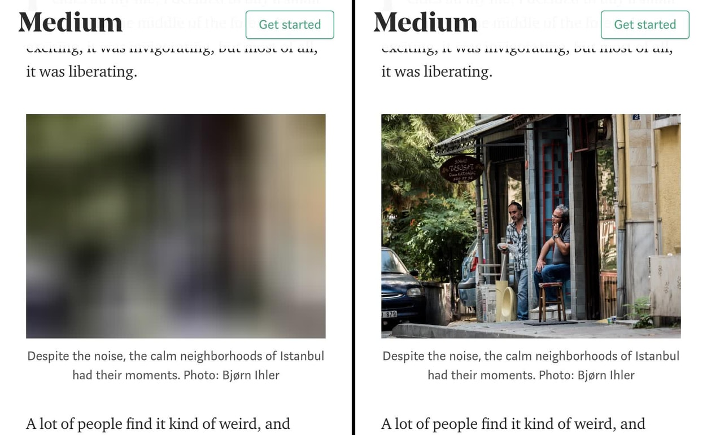

# 使用延迟加载提高加载速度

网站典型负载中的图像和视频可能占据了相当大的比重。不幸的是，项目利益相关者可能不愿意从现有的应用程序中削减任何媒体资源。这种两难的局面令人沮丧，尤其是当所有相关方都想提高网站性能，但无法就如何实现这一目标达成一致时。幸运的是，延迟加载是一种降低初始页面有效负载和加载时间的解决方案，但同时不会对内容造成负面影响。

## 什么是延迟加载？

延迟加载是一种在页面加载时推迟加载非关键资源的技术。相反，只会在需要时加载这些非关键资源。就图像而言，“非关键”就是指“屏幕外”。如果您使用过 Lighthouse 并检查了一些改进的机会，您可能已经在推迟屏幕外图像审计中看到了这方面的部分指南：

Lighthouse 中推迟屏幕外图像审计的屏幕截图。

Lighthouse 的性能审计之一是识别屏幕外图像，这是延迟加载的候选对象。
您可能已经看到了延迟加载的实现，它是这样的：

- 您抵达一个页面，并在阅读内容时开始滚动。
- 在某个时候，您将占位符图像滚动到视区中。
- 占位符图像突然被最终图像替换。

在热门发布平台 Medium 上可以找到一个图像延迟加载的例子，它在页面加载时加载轻量级占位符图像，并在它们滚动到视区时用延迟加载的图像替换它们。

浏览中的网站 Medium 截图，它展示了延迟加载的作用。模糊的占位符在左边，加载的资源在右边。

图像延迟加载的示例。占位符图像在页面加载时加载（左），当滚动到视区时，最终图像在需要时加载。

如果您还不熟悉延迟加载，那么可能想知道该技术的作用以及好处。请仔细阅读，找出答案！

## 为什么要延迟加载图像或视频而不是直接加载？

因为用户可能永远不会看到您正在加载的内容。这样做是有问题的，因为：

- 它会浪费数据。如果不按流量计费，那么这并不是最糟糕的事情（尽管您可能会使用宝贵的带宽来下载用户确实会看到的其他资源）。然而，如果用户的连接使用计费流量，那么加载用户从未见过的内容就是在浪费他们的钱。
- 它会浪费处理时间、电池和其他系统资源。下载媒体资源后，浏览器必须对其进行解码并在视区中呈现其内容。
延迟加载图像和视频减少了初始页面加载时间、初始页面的大小和系统资源使用，所有这些都可以提高性能。

## 实现延迟加载

有多种方法可以实现延迟加载。在选择解决方案时，必须考虑支持的浏览器以及尝试延迟加载的内容。

现代浏览器实现了浏览器级别的延迟加载，可以通过对图像和 iframe 使用loading属性实现。为了提供与旧浏览器的兼容性、或对没有内置延迟加载的元素执行延迟加载，您可以通过 JavaScript 实现。还有一些现有的库可以帮助您做到这一点。有关所有这些方法的完整详细信息，请参阅本网站的其他文章：

- 延迟加载图片
- 延迟加载视频

此外，我们还编写了一份延迟加载的潜在问题列表，以及在实现中需要注意的事项。

## 结论

请谨慎使用，延迟加载图像和视频会严重降低网站上的初始加载时间和页面负载。用户不会因他们可能永远不会看到的媒体资源而招致不必要的网络活动和处理成本，但如果他们愿意，那么仍然可以查看这些资源。

就性能改进技术而言，延迟加载是没有争议的。如果您的网站中有大量内嵌图像，这是减少不必要下载的绝佳方式。网站的用户和项目利益相关者会感激您的付出！
