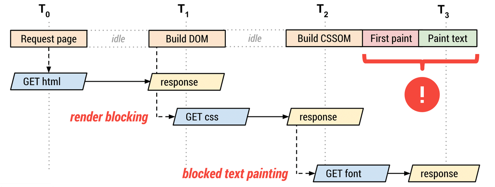

# 优化 WebFont 加载和呈现

包含所有样式变体（您可能不需要）以及所有字形（可能不使用）的“完整” WebFont，很容易导致数兆字节的下载。在本文中，您将了解如何优化 WebFonts 的加载，以便访问者只下载他们将使用的内容。

为了解决包含所有变体的大文件的问题，`@font-face` CSS 规则专门设计用于允许您将字体系列拆分为资源集合。例如 unicode 子集和不同的样式变体。

鉴于这些声明，浏览器会计算出所需的子集和变体，并下载呈现文本所需的最小集合，这非常方便。但是，如果您不小心，它也会在关键呈现路径中造成性能瓶颈并延迟文本呈现。

## 体默认行为

字体的延迟加载具有重要的隐藏含义，可能会延迟文本呈现：浏览器必须先构建依赖于 DOM 和 CSSOM 树的呈现树，然后才能知道它需要哪些字体资源来呈现文本。因此，字体请求会在其他关键资源之后延迟很长时间，并且在获取资源之前浏览器可能无法呈现文本。



1. 浏览器请求 HTML 文档。
2. 浏览器开始解析 HTML 响应并构建 DOM。
3. 浏览器发现 CSS、JS 和其他资源并调度请求。
4. 浏览器在接收到所有 CSS 内容后构建 CSSOM，并将其与 DOM 树组合以构建呈现树。
  - 字体请求在呈现树指示需要哪些字体变体来呈现页面上的指定文本后分派。
5. 浏览器执行布局并将内容绘制到屏幕上。
  - 如果字体尚不可用，浏览器可能不会呈现任何文本像素。
  - 字体可用后，浏览器会绘制文本像素。

页面内容的第一次绘制（可以在呈现树构建后不久完成）与对字体资源的请求之间的“竞争”是造成“空白文本问题”的原因，浏览器可能会呈现页面布局但忽略任何文本。

通过预加载 WebFonts 并使用 font-display 来控制浏览器如何处理不可用的字体，您可以防止由于字体加载而导致的空白页面和布局偏移。

## 预加载 WebFont 资源

如果您的页面很有可能需要在您事先知道的 URL 上托管特定的 WebFont，您可以利用资源优先级。使用 `<link rel="preload">` 将在关键呈现路径的早期触发对 WebFont 的请求，而无需等待创建 CSSOM。

## 自定义文本呈现延迟

虽然预加载使呈现页面内容时 WebFont 更有可能可用，但它不提供任何保证。您仍然需要考虑浏览器在呈现使用尚不可用的 `font-family` 文本时的行为。

在帖文[避免字体加载期间的不可见文本](./avoid-invisible-text.md)中，您可以看到默认的浏览器行为不一致。不过，您可以使用 `font-display` 告诉现代浏览器您希望它们如何表现。

与某些浏览器实现的现有字体超时行为类似，`font-display` 将字体下载的生命周期划分为三个主要时期：

1. 第一个是**字体块期**。在此期间，如果未加载字体，则任何尝试使用字体的元素都必须使用不可见的后备字体进行呈现。如果字体在块期间成功加载，则字体可以正常使用。
2. **字体交换期**紧接在字体块期之后。在此期间，如果未加载字体，则任何尝试使用字体的元素都必须使用后备字体进行呈现。如果字体在交换期间成功加载，则字体将正常使用。
3. **字体失效期**在字体交换期之后立即发生。如果在此期间开始时字体尚未加载，则将其标记为加载失败，从而导致正常的字体回退。否则，正常使用字体。

了解这些时期意味着您可以使用 `font-display` 来决定您的字体应如何呈现，具体取决于是否或何时下载。

要使用 `font-display` 属性，请将其添加到您的 `@font-face` 规则中：

```css
@font-face {
  font-family: 'Awesome Font';
  font-style: normal;
  font-weight: 400;
  font-display: auto; /* or block, swap, fallback, optional */
  src: local('Awesome Font'),
       url('/fonts/awesome-l.woff2') format('woff2'), /* will be preloaded */
       url('/fonts/awesome-l.woff') format('woff'),
       url('/fonts/awesome-l.ttf') format('truetype'),
       url('/fonts/awesome-l.eot') format('embedded-opentype');
  unicode-range: U+000-5FF; /* Latin glyphs */
}
```

`font-display` 目前支持以下范围的值：

- `auto`
- `block`
- `swap`
- `fallback`
- `optional`

有关预加载字体和 `font-display` 属性的更多信息，请参阅以下帖文：

- [避免字体加载期间不可见的文本](./avoid-invisible-text.md)
- 使用 font-display 控制字体性能
- 通过预加载可选字体防止布局偏移和不可见文本 (FOIT) 闪烁

## 字体加载 API

同时使用 `<link rel="preload">` 和 CSS `font-display` 可让您对字体的加载和呈现进行自如地控制，不会增加太多开销。但是，如果您需要额外的自定义项目，并且愿意承担运行 JavaScript 所带来的开销，还有另一种选择。

字体加载 API 提供脚本接口来定义和操作 CSS 字体、跟踪它们的下载进度，并覆盖它们的默认延迟加载行为。例如，如果您确定需要特定的字体变体，您可以定义它并告诉浏览器立即启动字体资源的获取：

```javascript
var font = new FontFace("Awesome Font", "url(/fonts/awesome.woff2)", {
  style: 'normal', unicodeRange: 'U+000-5FF', weight: '400'
});

// don't wait for the render tree, initiate an immediate fetch!
font.load().then(function() {
  // apply the font (which may re-render text and cause a page reflow)
  // after the font has finished downloading
  document.fonts.add(font);
  document.body.style.fontFamily = "Awesome Font, serif";

  // OR... by default the content is hidden,
  // and it's rendered after the font is available
  var content = document.getElementById("content");
  content.style.visibility = "visible";

  // OR... apply your own render strategy here...
});
```

此外，因为您可以检查字体状态（通过 `check()` ）方法并跟踪其下载进度，因此您还可以定义在页面上呈现文本的自定义策略：

- 您可以保留对所有文本的呈现，直到字体可用。
- 您可以为每种字体实现自定义超时。
- 您可以使用回退字体来解锁呈现，并在字体可用后注入使用所需字体的新样式。

最重要的是，您还可以针对页面上的不同内容混合搭配上述策略。例如，您可以延迟某些部分的文本呈现，直到字体可用，使用后备字体，然后在字体下载完成后重新呈现。

字体加载 API 在旧浏览器中不可用。考虑使用 FontLoader polyfill 或 WebFontloader 库来提供类似的功能，尽管额外的 JavaScript 依赖会带来更多开销。

## 适当的缓存十分必要

字体资源通常是不经常更新的静态资源。因此，它们非常适合长时间的最大寿命期 - 确保为所有字体资源指定条件 ETag 标头和最佳缓存控制策略。

如果您的 Web 应用程序使用服务工作进程 ，则使用缓存优先策略提供字体资源适用于大多数用例。

不应该使用 localStorage 或 IndexedDB 存储字体；因为它们中的每一个都有自己的一套性能问题。浏览器的 HTTP 缓存提供最佳和最强大的机制来向浏览器传送字体资源。

## WebFont 加载清单

- 使用 `<link rel="preload">` 、`font-display` 或字体加载 API 自定义字体加载和呈现：默认的延迟加载行为可能会导致文本呈现延迟。这些 Web 平台功能允许您为特定字体覆盖此行为，并为页面上的不同内容指定自定义呈现和超时策略。
- 指定重新验证和最佳缓存策略：字体是不经常更新的静态资源。确保您的服务器提供长时间的最大寿命期时间戳和重新验证令牌，以允许在不同页面之间有效地重用字体。如果使用服务工作进程，则缓存优先策略是合适的选择。

## 使用 Lighthouse 自动测试 WebFont 加载行为

Lighthouse 可以帮助自动执行相关过程，确保您遵循 Web 字体优化的最佳实践。

以下审计可以帮助您确保您的页面随着时间的推移继续遵循 Web 字体优化最佳实践：

- 预加载密钥请求
- 对静态资产使用低效的缓存策略
- 在 WebFont 加载期间所有文本保持可见
