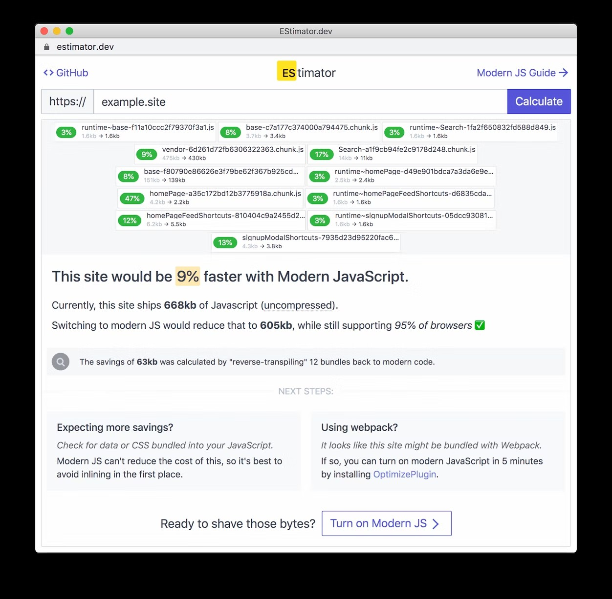

# 发布、传输和安装现代 JavaScript 以实现更快的应用程序

超过 90% 的浏览器能够运行现代 JavaScript，但传统 JavaScript 的流行仍然是当今 Web 性能问题的最大原因之一。EStimator.dev 是一个简单的基于 Web 的工具，它可以计算网站在采用现代 JavaScript 语法后可实现的尺寸和性能改进。



当今的 Web 受到传统 JavaScript 限制，没有任何单一优化可以像使用 ES2017 语法编写、发布和传输网页或软件包那样提高性能。

## 现代 JavaScript

现代 JavaScript 的特征不是使用特定的 ECMAScript 规范版本编写代码，而是使用所有现代浏览器都支持的语法。Chrome、Edge、Firefox 和 Safari 等现代网络浏览器占据浏览器市场的 90% 以上，依赖相同底层渲染引擎的其他浏览器占另外 5%。这意味着全球 95% 的 Web 流量所来自的浏览器支持过去 10 年来最广泛使用的 JavaScript 语言特性，包括：

- 类 (ES2015)
- 箭头函数 (ES2015)
- 生成器 (ES2015)
- 块范围 (ES2015)
- 解构 (ES2015)
- 剩余和展开参数 (ES2015)
- 对象速记 (ES2015)
- 异步/等待 (ES2017)

较新版本的语言规范中的特性在现代浏览器中获得的支持通常不太一致。例如，许多 ES2020 和 ES2021 特性仅在 70% 的浏览器市场获得支持 — 仍然是大多数浏览器，但还不够安全，不能直接依赖这些特性。这意味着尽管“现代” JavaScript 是一个活动目标，但 ES2017 拥有最广泛的浏览器兼容性，同时包含大多数常用的现代语法特性。换句话说，**ES2017 目前最接近现代语法**。

## 传统 JavaScript

传统 JavaScript 是明确避免使用上述所有语言特性的代码。大多数开发人员使用现代语法编写源代码，但将所有内容编译为传统语法以增加浏览器支持。编译为传统语法确实会增加浏览器支持，但效果通常比我们想象的小。在许多情况下，支持度从 95% 左右增加到 98%，但同时产生了大量成本：

- 传统 JavaScript 通常比等效的现代代码大 20% 左右，而且速度更慢。工具缺陷和错误配置通常会进一步扩大这一差距。
- 安装的库占典型生产 JavaScript 代码的 90%。库代码会由于 polyfill 和 helper 重复而产生更高的传统 JavaScript 开销，而发布现代代码可以避免这个问题。

## npm 上的现代 JavaScript

最近，Node.js 标准化了一个 `"exports"` 字段来定义软件包的入口点：

```javascript
{
  "exports": "./index.js"
}
```

`"exports"` 字段引用的模块意味着 Node 版本至少为 12.8，它支持 ES2019。这意味着使用 `"exports"` 字段引用的任何模块都可以使用现代 JavaScript 编写。软件包使用者必须假定具有 `"exports"` 字段的模块包含现代代码并在必要时进行转换。

### 仅现代

如果要发布采用现代代码的软件包，并让使用者在将其用作依赖项时处理转换，则仅使用 `"exports"` 字段。

```javascript
{
  "name": "foo",
  "exports": "./modern.js"
}
```

**小心**

不推荐这种方法。在完美的世界中，每个开发人员都已经将编译系统配置为将所有依赖项 (`node_modules`) 转换为所需语法。但是，目前情况并非如此，仅使用现代语法发布软件包将使其无法在通过旧版浏览器访问的应用程序中使用。

### 具有传统回退的现代代码

将 `"exports"` 字段与 `"main"` 一起使用，以便使用现代代码发布软件包，但还包括用于旧版浏览器的 ES5 + CommonJS 回退。

```javascript
{
  "name": "foo",
  "exports": "./modern.js",
  "main": "./legacy.cjs"
}
```

### 具有传统回退的现代代码和 ESM 捆绑程序优化

除了定义回退 CommonJS 入口点，还可以使用 `"module"` 字段指向类似的传统回退捆绑包，但该捆绑包使用 JavaScript 模块语法 (`import` 和 `export`)。

```javascript
{
  "name": "foo",
  "exports": "./modern.js",
  "main": "./legacy.cjs",
  "module": "./module.js"
}
```

许多捆绑程序（如 webpack 和 Rollup）依赖该字段来利用模块特性和实现摇树优化。这仍然是一个传统捆绑包，不包含除了 import/export 语法之外的任何现代代码，所以使用这种方法来传输具有传统回退、但仍然针对捆绑进行了优化的现代代码。

## 应用程序中的现代 JavaScript

第三方依赖项构成了 Web 应用程序中绝大多数的典型生产 JavaScript 代码。虽然 npm 依赖项在历史上一直以 ES5 语法的形式发布，但这不再是一个安全假设，并且依赖项更新可能会破坏应用程序的浏览器支持。

随着越来越多的 npm 包转向现代 JavaScript，确保构建工具设置为能够处理它们很重要。您所依赖的一些 npm 包很有可能已经在使用现代语言特性。有许多选择可使用 npm 中的现代代码而不会破坏应用程序在旧版浏览器中的体验，但总体思路是让编译系统将依赖项转换为与源代码相同的目标语法。

## webpack

从 webpack 5 开始，现在可以配置 webpack 在生成捆绑包和模块的代码时将使用的语法。这不会转换您的代码或依赖项，只影响由 webpack 生成的“粘附”代码。要指定浏览器支持目标，请在您的项目中添加一个 browserslist 配置，或者直接在 webpack 配置中添加：

```javascript
module.exports = {
  target: ['web', 'es2017'],
};
```

还可以将 webpack 配置为生成优化的捆绑包，当以现代 ES 模块环境为目标时，这些捆绑包会省略不必要的包装函数。这也将 webpack 配置为使用 `<script type="module">` 加载代码拆分捆绑包。

```javascript
module.exports = {
  target: ['web', 'es2017'],
  output: {
    module: true,
  },
  experiments: {
    outputModule: true,
  },
};
```

有许多 webpack 插件可以编译和传输现代 JavaScript，同时仍然支持旧版浏览器，例如 Optimize Plugin 和 BabelEsmPlugin。

### Optimize Plugin

Optimize Plugin 是一个 webpack 插件，它可以将最终的捆绑代码从现代 JavaScript 转换为传统 JavaScript，而不是单独的源文件。它是一个自包含设置，允许 webpack 配置假定所有内容都是现代 JavaScript，没有针对多个输出或语法的特殊分支。

由于 Optimize Plugin 针对捆绑包而不是单个模块进行操作，因此它会平等处理应用程序代码和依赖项。这样便可以安全地使用 npm 中的现代 JavaScript 依赖项，因为它们的代码将被捆绑并转换为正确的语法。它还可以比涉及两个编译步骤的传统解决方案更快，同时仍然为现代和旧版浏览器生成单独的捆绑包。这两套捆绑包设计为使用模块/无模块模式加载。

```javascript
// webpack.config.js
const OptimizePlugin = require('optimize-plugin');

module.exports = {
  // ...
  plugins: [new OptimizePlugin()],
};
```

Optimize Plugin 可以比自定义 webpack 配置更快、更高效，后者通常单独捆绑现代和传统代码。它还可以处理运行中的 Babel，并使用 Terser 以单独的针对现代和传统输出优化的设置，使捆绑包最小化。最后，生成的传统捆绑包所需的 polyfill 将提取到一个专用脚本中，这样在较新的浏览器中不会复制或不必要地加载它们。

<video autoplay loop muted playsinline width="700px">
  <source src="./img/transpile-before-after.webm" type="video/webm">
</video>

比较：转换源模块两次与转换生成的捆绑包

### BabelEsmPlugin

BabelEsmPlugin 是一个 webpack 插件，它与 `@babel/preset-env` 一起工作来生成现有捆绑包的现代版本，以将更少的转换代码传输到现代浏览器。它是 Next.js 和 Preact CLI 使用最多的模块/无模块现成解决方案。

```javascript
// webpack.config.js
const BabelEsmPlugin = require('babel-esm-plugin');

module.exports = {
  //...
  module: {
    rules: [
      // your existing babel-loader configuration:
      {
        test: /\.js$/,
        exclude: /node_modules/,
        use: {
          loader: 'babel-loader',
          options: {
            presets: ['@babel/preset-env'],
          },
        },
      },
    ],
  },
  plugins: [new BabelEsmPlugin()],
};
```

`BabelEsmPlugin` 支持多种 webpack 配置，因为它运行应用程序的两个基本独立的版本。对于大型应用程序，编译两次可能需要一点额外的时间，但是这种技术允许 `BabelEsmPlugin` 无缝集成到现有 webpack 配置中，使其成为最方便的选择之一。

### 将 babel-loader 配置为转换 node_modules

如果使用 `babel-loader` 而没有使用前两个插件之一，则需要执行一个重要的步骤才能使用现代 JavaScript npm 模块。定义两个单独的 `babel-loader` 配置可以将 `node_modules` 中的现代语言特性自动编译为 ES2017，同时仍然使用 Babel 插件和项目配置中定义的预设来转换您自己的第一方代码。这不会为模块/无模块设置生成现代和传统捆绑包，但可以安装和使用包含现代 JavaScript 的 npm 软件包，而不会破坏旧版浏览器体验。

webpack-plugin-modern-npm 使用这种技术来编译在 `package.json` 中具有 `"exports"` 字段的 npm 依赖项，因为它们可能包含现代语法：

```javascript
// webpack.config.js
const ModernNpmPlugin = require('webpack-plugin-modern-npm');

module.exports = {
  plugins: [
    // auto-transpile modern stuff found in node_modules
    new ModernNpmPlugin(),
  ],
};
```

或者，可以通过在解析模块时检查 `package.json` 中是否存在 `"exports"` 字段，在 webpack 配置中手动实现该技术。为简洁起见而省略缓存，自定义实现可能如下所示：

```javascript
// webpack.config.js
module.exports = {
  module: {
    rules: [
      // Transpile for your own first-party code:
      {
        test: /\.js$/i,
        loader: 'babel-loader',
        exclude: /node_modules/,
      },
      // Transpile modern dependencies:
      {
        test: /\.js$/i,
        include(file) {
          let dir = file.match(/^.*[/\\]node_modules[/\\](@.*?[/\\])?.*?[/\\]/);
          try {
            return dir && !!require(dir[0] + 'package.json').exports;
          } catch (e) {}
        },
        use: {
          loader: 'babel-loader',
          options: {
            babelrc: false,
            configFile: false,
            presets: ['@babel/preset-env'],
          },
        },
      },
    ],
  },
};
```

使用此方法时，您需要确保缩小器支持现代语法。Terser 和 uglify-es 都有指定 `{ecma: 2017}` 的选项，以便在压缩和格式化期间保留 ES2017 语法并在某些情况下生成该语法。

## Rollup

Rollup 内部支持生成多组捆绑包作为单个版本的一部分，并默认生成现代代码。因此，可以将 Rollup 配置为通过您可能已经在使用的官方插件生成现代和传统捆绑包。

### @rollup/plugin-babel

如果使用 Rollup，`getBabelOutputPlugin()` 方法（由 Rollup 的官方 Babel 插件提供）会转换生成的捆绑包中的代码，而不是单个源模块。Rollup 内部支持生成多组捆绑包作为单个版本的一部分，每个捆绑包都有自己的插件。您可以通过不同的 Babel 输出插件配置来传递各个捆绑包，从而生成不同的现代和传统捆绑包：

```javascript
// rollup.config.js
import {getBabelOutputPlugin} from '@rollup/plugin-babel';

export default {
  input: 'src/index.js',
  output: [
    // modern bundles:
    {
      format: 'es',
      plugins: [
        getBabelOutputPlugin({
          presets: [
            [
              '@babel/preset-env',
              {
                targets: {esmodules: true},
                bugfixes: true,
                loose: true,
              },
            ],
          ],
        }),
      ],
    },
    // legacy (ES5) bundles:
    {
      format: 'amd',
      entryFileNames: '[name].legacy.js',
      chunkFileNames: '[name]-[hash].legacy.js',
      plugins: [
        getBabelOutputPlugin({
          presets: ['@babel/preset-env'],
        }),
      ],
    },
  ],
};
```

## 其他构建工具

Rollup 和 webpack 是高度可配置的，这通常意味着每个项目都必须更新其配置以在依赖项中启用现代 JavaScript 语法。还有更高级的构建工具更倾向于惯例和默认值，而不是配置，例如 Parcel、Snowpack、Vite 和 WMR。这些工具中的大多数假定 npm 依赖项可能包含现代语法，并在生产编译时将它们转换为适当的语法级别。

除了 webpack 和 Rollup 的专用插件，还可以使用 devolution 将具有传统回退的现代 JavaScript 捆绑包添加到任何项目中。Devolution 是一个独立的工具，可转换编译系统的输出以生成传统 JavaScript 变体，从而允许捆绑和转换采用现代输出目标。

## 结论

EStimator.dev 旨在提供一种简单的方法来评估切换到具有现代功能的 JavaScript 代码对大多数用户的影响。目前，ES2017 最接近现代语法，通过 npm、Babel、webpack 和 Rollup 等工具可以配置编译系统并使用该语法编写软件包。本文涵盖了几种方法，您应该根据您的用例选择最简单的一个。
