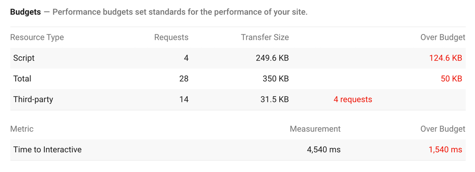

# 使用 Lighthouse 进行性能预算

Lighthouse 现在支持性能预算。LightWallet 功能可在不到五分钟的时间内设置好，其可提供关于页面资源的大小和数量的反馈。

## 安装 Lighthouse

LightWallet 在 Lighthouse v5+ 的命令行版本中可用。

首先，安装 Lighthouse：

```bash
npm install -g lighthouse
```

## 创建预算

创建一个名为 budget.json 的文件。在此文件中添加以下 JSON：


```javascipt
[
  {
    "path": "/*",
    "timings": [
      {
        "metric": "interactive",
        "budget": 3000
      },
      {
        "metric": "first-meaningful-paint",
        "budget": 1000
      }
    ],
    "resourceSizes": [
      {
        "resourceType": "script",
        "budget": 125
      },
      {
        "resourceType": "total",
        "budget": 300
      }
    ],
    "resourceCounts": [
      {
        "resourceType": "third-party",
        "budget": 10
      }
    ]
  }
]
```

此示例 `budget.json` 文件设置了五个单独的预算：

- 互动时间的预算为 3000 毫秒。
- 第一次有意义的绘制预算为 1000 毫秒
- 页面上 JavaScript 总量的预算为 125 KB。
- 页面整体大小的预算为 300 KB。
- 向第三方来源发出的请求数量的预算为 10 个请求。
- 有关受支持的性能指标和资源类型的完整列表，请参阅 Lighthouse 文档的性能预算部分。

## 运行 Lighthouse

使用 `--budget-path` 标志运行 Lighthouse。此标志会告诉 Lighthouse 您的预算文件的位置。

```bash
lighthouse https://example.com --budget-path=./budget.json
```
注意：预算文件不必命名为 `budget.json`。

## 查看结果

如果已正确配置 LightWallet，Lighthouse 报告将包含**性能**类别内的**预算**部分。



上图为 Lighthouse 报告的'预算'部分  

在 Lighthouse 报告的 JSON 版本中，可以在 `performance-budget` 审计的审计结果中找到 Lightwallet 结果。
