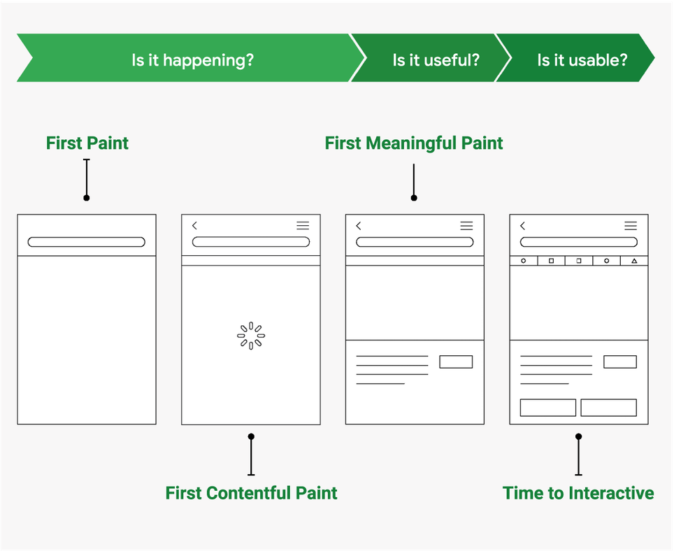

# 速度是什么？

速度很重要，但是速度，对于我们究竟确切的代表什么？拥有一个快速的网站又意味着什么？

经常听到人们谈论，在 x.xx 秒或类似的时间内，他们的网站完成加载。但加载不是一个单一的时刻；这是一种没有一个指标可以完全捕获的体验。在加载体验期间，有多个时刻可能会影响用户是否将其视为"快速"，如果您只关注一个时刻，则可能会错过其余时间发生的不良体验。

您不应仅使用一个指标来衡量负载，而应确定体验期间影响用户对负载速度感知的每个时刻的时间。当用户导航到网页时，他们通常会查找某些类型的反馈：

加载时间或 DOMContent 加载时间等传统性能指标不可靠，因为它们的发生可能与这些反馈里程碑相对应，也可能不相对应。因此，出现了其他指标，可用于了解页面何时向其用户提供此反馈：

请务必了解这些指标提供的不同见解，然后确定对用户体验很重要的见解。一些品牌甚至定义了特定于人们对其服务的期望的其他自定义指标。在Pinterest的情况下，用户希望看到图像，因此他们定义了一个自定义指标Pinner等待时间，该指标结合了交互式时间和折叠图像加载时间。

即使负载不止一个时刻，为了简化报告或比较的目的，使用单个指标仍然很有用：速度指数和灯塔分数都可以以这种方式使用。
